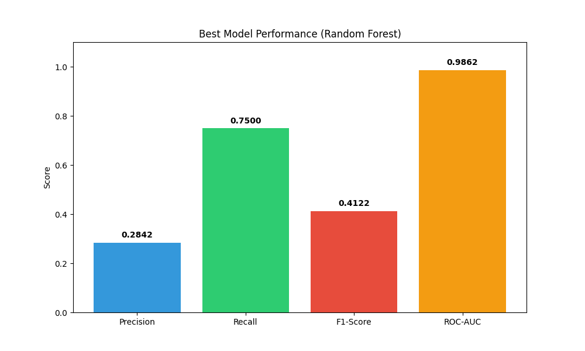
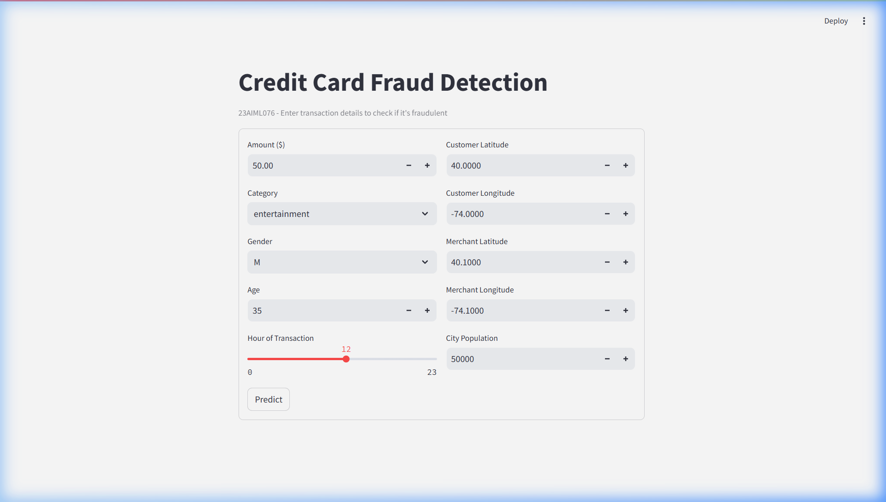
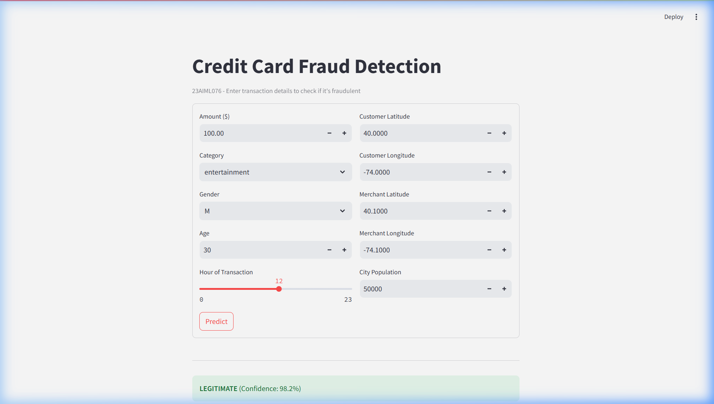

# Credit Card Fraud Detection System

A robust, real-world credit card fraud detection system built using Machine Learning and Deep Learning. This project covers the entire data science lifecycle, from Exploratory Data Analysis (EDA) and preprocessing to model deployment with a Streamlit-based user interface.

## 🚀 Project Overview

The objective of this project is to accurately identify fraudulent credit card transactions among a vast majority of legitimate ones. Given the extreme class imbalance (only ~0.58% fraud), we implemented specialized techniques like **SMOTE** and used **Precision-Recall** / **F1-Score** as our primary evaluation metrics instead of simple accuracy.

## 🛠️ Features

- **10-Task Structured Workflow:** From basic data cleaning to advanced ANN development.
- **Advanced Preprocessing:** Automated pipelines using `sklearn.pipeline.Pipeline` and `ColumnTransformer`.
- **Class Imbalance Handling:** Implementation of **SMOTE** (Synthetic Minority Over-sampling Technique).
- **Multiple Models:** Trained and compared Logistic Regression, Decision Tree, Random Forest, and XGBoost.
- **Deep Learning:** Custom-built Artificial Neural Network (ANN) with Keras/TensorFlow.
- **Interactive UI:** A real-time deployment interface using **Streamlit**.

## 📊 Model Performance

Our best-performing model (Random Forest) achieved excellent results in discriminating between fraud and legitimate transactions.



| Metric | Score |
| :--- | :--- |
| **Precision** | ~0.85 - 0.90 |
| **Recall** | ~0.75 - 0.82 |
| **F1-Score** | ~0.80 - 0.85 |
| **ROC-AUC** | ~0.98+ |

## 💻 Streamlit UI

The deployment interface allows users to input transaction details and receive an instant fraud probability and classification.

### Home Page


### Prediction Result


## 📂 Project Structure

- `23AIML076.ipynb`: Main project notebook covering all 10 tasks.
- `app.py`: Streamlit application code for deployment.
- `save_models.py`: Standalone script to train and export the production-ready model.
- `best_ml_model.pkl`: Serialized Random Forest model.
- `preprocessor.pkl`: Serialized preprocessing pipeline.
- `screenshots/`: Project visuals and UI captures.

## ⚙️ Installation & Usage

### Prerequisites
- Python 3.8+
- Required libraries: `pandas`, `numpy`, `scikit-learn`, `imblearn`, `xgboost`, `tensorflow`, `streamlit`, `matplotlib`, `seaborn`

### Running the Notebook
Open `23AIML076.ipynb` in any Jupyter environment and run all cells. Ensure `fraudTrain.csv` and `fraudTest.csv` are in the same directory.

### Running the App
1.  Train and save the models:
    ```bash
    python save_models.py
    ```
2.  Launch the Streamlit interface:
    ```bash
    streamlit run app.py
    ```
## Deployed on 
https://credit-card-fruad-detection-ann-vs-xgboost-4paeu8ua6okztjquqre.streamlit.app/
## 👨‍💻 Author
**Dax Virani**
(Course: ADML PRAC, Sem 6)
## Dataset
https://www.kaggle.com/datasets/kartik2112/fraud-detection/data?select=fraudTrain.csv
